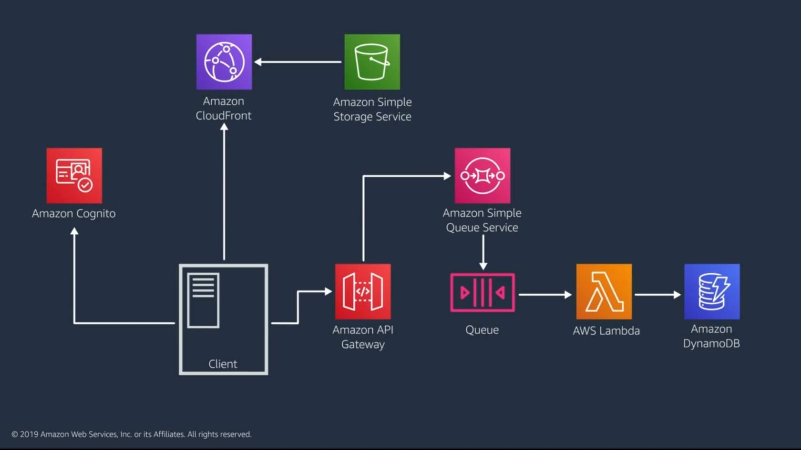

# AWS Shop


A basic shopping app that utilizes various AWS services

## Architecture Diagram

(_Tentative_)



**Front End**

- CodeBuild is used to test the React app, build it, and deploy to S3.
- The S3 bucket will hold the optimized production build for the React app. Since CloudFront will host the website, we don't need to enable static website hosting on the bucket. And I made sure to secure the bucket from public access. A bucket policy was created to only make the website accessible by a secure CloudFront distribution.
- CloudFront hosts the website across multiple edge locations across North America, Europe, and Israel (to save on costs). It uses Origin Access Control (OAC) to securely connect to S3 as its origin.

## Directions

1. Build the infrastructure using CloudFormation.
2. Use CodeBuild to test the app, build it, and upload the build to S3.

## Using the CLI

Run `aws configure` and pass in your access key ID, secret access key, default region, and default ouput format. (Run `aws sts get-caller-identity` to verify you're signed in as the right user.)

### CloudFormation Commands

Create stack:

```bash
aws cloudformation create-stack --stack-name NAME --template-body FILE_PATH --parameters ParameterKey=KEY,ParameterValue=VALUE
```

List stacks:

```bash
aws cloudformation list-stacks
aws cloudformation describe-stacks # more detailed than list-stacks
```

Update stack:

```bash
aws cloudformation update-stack --stack-name NAME --template-body FILE_PATH --parameters ParameterKey=KEY,ParameterValue=VALUE
```

Delete stack:

```bash
aws cloudformation delete-stack --stack-name NAME
```
