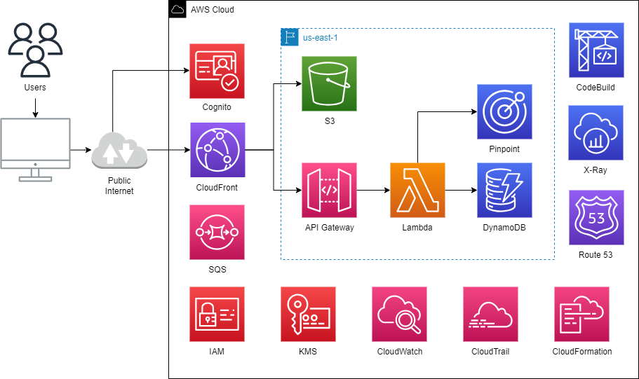
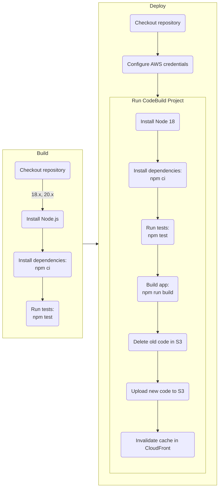

# AWS Shop


[](https://github.com/Abhiek187/aws-shop/actions/workflows/cfn.yml)
[](https://github.com/Abhiek187/aws-shop/actions/workflows/codeql.yml)
[](https://github.com/Abhiek187/aws-shop/actions/workflows/dependency-review.yml)
[](https://github.com/Abhiek187/aws-shop/actions/workflows/node.js.yml)
[](https://github.com/Abhiek187/aws-shop/actions/workflows/python-app.yml)

## Overview

AWS is a broad ecosystem for modernizing applications in the cloud. Due to its sheer size, it can be daunting for newcomers to dip their toes into the world of AWS. There are hundreds of services to choose from with their own pricing models. It's easy to rack up a high AWS bill if you're not careful, but there are plenty of services with a generous free tier that are simple for beginners to use. This is the main inspiration behind AWS Shop.

_(Note that this is not meant to replace any training or certifications from AWS, but is a good way to get a high-level overview of all the main AWS services, whether you're new to AWS or need a refresher.)_

This is a basic shopping app that utilizes various AWS services. It is designed to help users new to AWS understand what each service offers and their costs. Similar to [How to Stock](https://github.com/Abhiek187/how-to-stock), users are provided a certain budget to simulate purchasing AWS services for their own projects. The architecture is designed with cost optimization and operational excellence in mind. Serverless tools help reduce the costs and everything is written as code to help test, version, and automate much of the application, infrastructure, and security of the project.

The front-end is a React app where users can browse many different AWS services in a simulated e-commerce environment. Each service is split into multiple categories based on the type of free tier AWS provides.

The back-end is a collection of microservices written in Python. The main one is an API that manages the AWS services stored in a database to display on the front-end. Other microservices help with automating everyday tasks and managing the AWS environment, including monitoring the health of AWS services, the age of access keys, and configurations that aren't compliant with AWS's best practices.

For each service, CI/CD pipelines are written using GitHub Actions to automate unit testing, integration testing, security testing, and deployments of both applications and infrastructure. Health checks are used to monitor both the front-end and back-end, and email notifications are sent if any resource is unhealthy.

## Architecture Diagram



_Created using [draw.io](https://www.draw.io/?splash=0&libs=aws4)_

### Front End

- CodeBuild is used to test the React app, build it, and deploy to S3.
- The S3 bucket will hold the optimized production build for the React app. Since CloudFront will host the website, we don't need to enable static website hosting on the bucket. A bucket policy was created to only make the website accessible by a secure CloudFront distribution. This way, we can block public access from the S3 bucket.
- CloudFront hosts the website across multiple edge locations across North America, Europe, and Israel (to save on costs). It uses Origin Access Control (OAC) to securely connect to S3 as its origin.

### Back End

- Information about all the AWS services is stored in a DynamoDB table. Global Secondary Indexes (GSIs) are used to help improve the performance of queries by certain filters, such as searching for services by price or category.
- A Lambda function handles the logic by the client to perform the appropriate CRUD operations on the DynamoDB table.
- The API is contructed using API Gateway. An OpenAPI spec defines which endpoints the client can call and how API Gateway transforms the requests and responses from Lambda. Rate limiting is applied to prevent heavy usage of the API.
- The API is then exposed to the client using CloudFront to improve performance via caching and edge locations. It also reduces the amount of API calls made to the rest of the back-end.
- On failure, a dead-letter queue (DLQ) is used to collect error messages from Lambda.

## Pipeline Diagrams

### Node.js (Front-End)



### Python (Back-End)


### CloudFormation


### CodeQL


## Directions

Both the front-end and back-end can be run locally without AWS. Directions for setting up each environment can be found in the **shop-app** and **microservices** directories respectively. To run the entire app in AWS:

1. Build the infrastructure using all the CloudFormation templates found here and in the **microservices** directory. They can be identified as YAML files that contain `AWSTemplateFormatVersion`.
2. Use CodeBuild to test the React app, build it, and upload the build to S3.
3. Open https://d23f1hp5lvetow.cloudfront.net/ in the browser.

## Using the CLI

Download the [AWS CLI](https://docs.aws.amazon.com/cli/latest/userguide/getting-started-install.html). Then run `aws configure` and pass in your access key ID, secret access key, default region, and default ouput format. (Run `aws sts get-caller-identity` to verify you're signed in as the right user.)

### CloudFormation Commands

Create stack:

```bash
aws cloudformation create-stack --stack-name NAME --template-body FILE_PATH --parameters ParameterKey=KEY,ParameterValue=VALUE --capabilities CAPABILITY_NAMED_IAM
```

List stacks:

```bash
aws cloudformation list-stacks
aws cloudformation describe-stacks # more detailed than list-stacks
```

Update stack:

```bash
aws cloudformation update-stack --stack-name NAME --template-body FILE_PATH --parameters PARAM_FILE_PATH --capabilities CAPABILITY_NAMED_IAM
```

Continue update rollback:

```bash
aws cloudformation continue-update-rollback --stack-name NAME [--resources-to-skip RESOURCE]
```

Delete stack:

```bash
aws cloudformation delete-stack --stack-name NAME
```

Detect stack drift:

```bash
aws cloudformation detect-stack-drift --stack-name NAME
```

Describe stack drift:

```bash
aws cloudformation describe-stack-resource-drifts --stack-name NAME --stack-resource-drift-status-filters DELETED MODIFIED
```

Describe stack drift status:

```bash
aws cloudformation describe-stack-drift-detection-status --stack-drift-detection-id DRIFT_ID
```

Create change set:

```bash
aws cloudformation create-change-set --stack-name NAME --change-set-name CHANGE_SET --template-body FILE_PATH --parameters PARAM_FILE_PATH --capabilities CAPABILITY_NAMED_IAM
```

List change sets:

```bash
aws cloudformation list-change-sets --stack-name my-stack
```

Describe change set:

```bash
aws cloudformation describe-change-set --stack-name NAME --change-set-name CHANGE_SET
```

Execute change set:

```bash
aws cloudformation execute-change-set --stack-name NAME --change-set-name CHANGE_SET
```

Delete change set:

```bash
aws cloudformation delete-change-set --stack-name NAME --change-set-name CHANGE_SET
```

#### cfn-guard

To run a security check of a CloudFormation template, follow [these steps](https://docs.aws.amazon.com/cfn-guard/latest/ug/setting-up-linux.html) to install `cfn-guard`. Then run:

```bash
cfn-guard validate --show-summary [pass|fail] --output-format [single-line-summary|json|yaml] --data FILE --rules cfn-guard-rules/
```

### CodeBuild Commands

Start build:

```bash
aws codebuild start-build --project-name NAME
```

List projects:

```bash
aws codebuild list-projects
```

List builds:

```bash
aws codebuild list-builds
aws codebuild list-builds-for-project --project-name NAME
```

Stop build:

```bash
aws codebuild stop-build --id BUILD_ID
```

### S3 Commands

List objects:

```bash
aws s3 ls S3_URI
```

### DynamoDB Commands

List tables:

```bash
aws dynamodb list-tables
```

Describe table:

```bash
aws dynamodb describe-table --table-name TABLE_NAME
```

Query table:

```bash
aws dynamodb query --table-name AWS-Services --projection-expression "Name,Price" --key-condition-expression "Category = :free" --expression-attribute-values file://expression-attributes.json --return-consumed-capacity TOTAL
```

Update table:

```bash
aws dynamodb batch-write-item --request-items file://aws-services.json --return-consumed-capacity INDEXES --return-item-collection-metrics SIZE
```

### SQS Commands

Receive messages:

```bash
aws sqs receive-message --queue-url URL --attribute-names All --message-attribute-names All --max-number-of-messages 10
```

Delete message:

```bash
aws sqs delete-message --queue-url URL --receipt-handle HANDLE
```

Purge queue:

```bash
aws sqs purge-queue --queue-url URL
```

### KMS Commands

List aliases:

```bash
aws kms list-aliases
```

## Rotating Access Keys

Rotate your access keys every 60 days by running the following shell script ([jq](https://stedolan.github.io/jq/) is required):

```bash
chmod u+x rotate-access-key.sh
./rotate-access-key.sh
```
