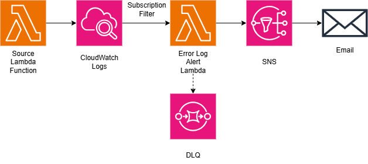

# Error Log Alert

## About

Error Log Alert is a reusable monitoring service that Lambda functions can utilize to get detailed notifications whenever certain logs, such as errors, are detected.

> [!NOTE]
>
> This service isn't deployable yet and is meant to serve as a proof-of-concept. The filter pattern and log group name are unique to each application.
