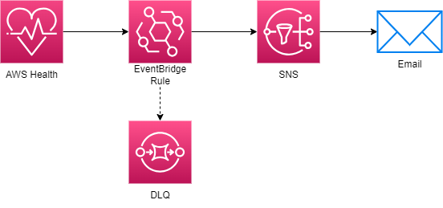

# AWS Health Alerts



## About

The Health Alerts microservice subscribes to health events from AWS Health using SNS. If any of the services listed in `template.yaml` goes down in the us-east-1 region, you will get an email notifying you of the incident, allowing system administrators to promptly take action. A dead-letter queue (DLQ) is used to catch any errors from EventBridge.

## Directions

Follow the directions in the [root README](../../README.md) to create the stack for the first time using the template and params files. In `params.json`, replace:

```json
"UsePreviousValue": true
```

with:

```json
"ParameterValue": "YOUR_EMAIL_ADDRESS"
```

replacing YOUR_EMAIL_ADDRESS with your email address.

On subsequent deployments, see the directions for either updating the stack or creating a change set. Keep `params.json` as it was originally.
