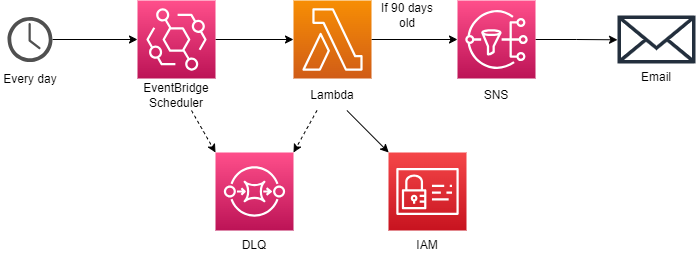

# IAM Old

## About

IAM Old is a service that checks the age of all the access keys for all IAM users daily. If the access key is 90 days old, an email is sent to remind the user to rotate their key.

**Note:** This service doesn't automatically rotate access keys since the secret is only displayed once and must be saved on the user's machine. Run [rotate-access-key.sh](../../rotate-access-key.sh) to accomplish both tasks.

## Directions

Run `sam build` to build the app. Then:

- When first creating the stack, run `sam deploy --parameter-overrides ParameterKey=Email,ParameterValue=YOUR_EMAIL_ADDRESS`, replacing YOUR_EMAIL_ADDRESS with your email address. You need to confirm your email subscription to get added to the SNS topic.
- On subsequent deployments, run `sam deploy` to reuse the same email address.
