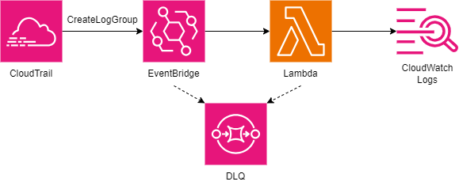

# CloudWatch Logs Retention

## About

The Log Retention microservice automatically sets the retention of log groups created by other stacks. This will save costs since most log groups default to having no retention policy. An EventBridge rule listens for newly created log groups and triggers a Lambda function to set the retention policy for all existing log groups.

## Directions

Run `sam build` to build the app. Then run `sam deploy` to deploy the app.
