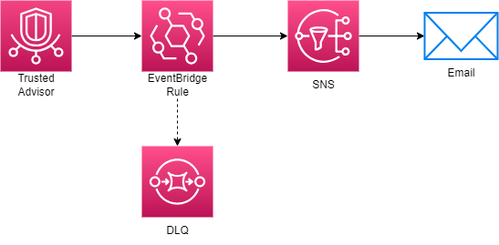

# Trusted Advisor (TA) Alerts



## About

The TA Alerts microservice subscribes to Trusted Advisor errors and warnings using SNS. This ensures developers are following the best practices for cost optimization, performance, security, fault tolerance, and service limits. On a Basic or Developer support plan, this will notify you of service limits and _some_ security alerts. A Business support plan or higher is required to subscribe to all checks from Trusted Advisor. A dead-letter queue (DLQ) is used to catch any errors from EventBridge.

## Directions

Follow the directions in the [root README](../../README.md) to create the stack for the first time using the template and params files. In `params.json`, replace:

```json
"UsePreviousValue": true
```

with:

```json
"ParameterValue": "YOUR_EMAIL_ADDRESS"
```

replacing YOUR_EMAIL_ADDRESS with your email address.

On subsequent deployments, see the directions for either updating the stack or creating a change set. Keep `params.json` as it was originally.
